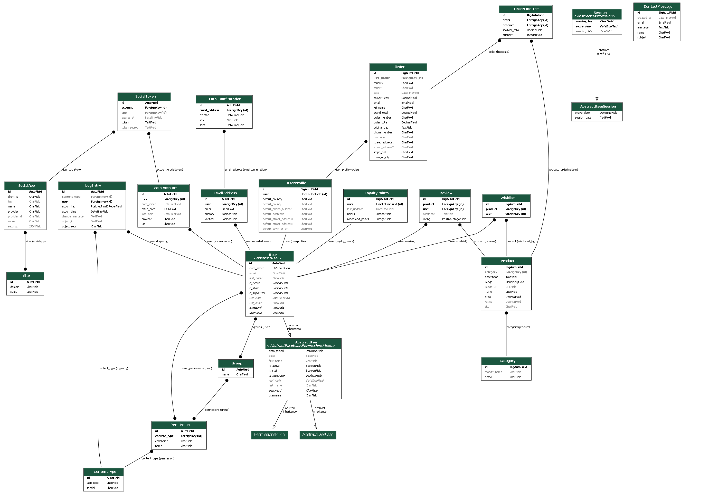

# Book Store

Book Store is an e-commerce platform designed to offer a seamless and enjoyable experience for book lovers. Our mission is to connect readers with a wide range of books, from bestsellers to hidden gems, and provide a user-friendly platform for exploring, purchasing, and reviewing books

### Visit the site deployed on Heroku: [Book-store](https://book-store-d7e28656e998.herokuapp.com/).

## Business Model

### Value Proposition

- A diverse collection of books across various genres and authors
- Easy navigation and recommendations for book enthusiasts

### Customer Segments

- Gift-buyers searching for books to give as thoughtful presents.
- Individuals purchasing books for personal development, self-help, or leisure reading.

### Revenue Streams

- Direct sales of books through the platform
- Partnerships with authors and publishers

### Cost Structure

- Inventory costs for books
- Website hosting and maintenance
- Marketing and advertising expenses
- Payment gateway fees

---

## Marketing Strategy

### Social Media Marketing

- Facebook and Instagram pages created to engage readers and promote collections
- Regular updates on new arrivals and promotional offers

### Email Marketing

- Integration with Mailchimp for newsletters and exclusive updates

### Future Marketing Ideas

- Collaborations with book bloggers and influencers
- Content marketing through blogs about book reviews and reading tips

---

## User Experience (UX)

### User Stories

- **As a general user, I can:**

  - Browse books by category, author, or title
  - View detailed descriptions and ratings of books
  - Add books to my cart and proceed to checkout

- **As an authenticated user, I can:**

  - Write ratings for books
  - View my order history
  - Add books to my wishlist

- **As an admin user, I can:**
  - Add, edit, or remove books from the inventory
  - Manage user accounts and orders
  - View analytics on sales and user interactions
  - View users ratings on books
  - Manage messages from users thru admin panel
  - Manage users loyalty points

---

## Features

### Homepage

- The homepage serves as the entry point to the e-commerce platform, showcasing featured books and categories to engage users.
- A **"Shop Now"** button is prominently displayed, allowing users to quickly navigate to the full product catalog.
- A **Newsletter Sign-Up** form is included to encourage users to subscribe for updates and special offers.
- Designed to be visually appealing and user-friendly, the homepage provides a seamless introduction to the site’s offerings.

### Search Functionality

- Advanced search options for finding books by title, author or description.

### Cart and Checkout

- Seamless addition and removal of books in the cart.
- Secure checkout process using Stripe.
- Apply loyalty points to get a discount (each point equals $1)
- Users earn 1 loyalty point for every $10 spent.

### Product Detail

- Each product detail page provides comprehensive information about the book, including it's description, price.
- **User Features**:
  - Users can rate books, leaving feedback and ratings to help others make informed decisions.
  - Users can add products to their cart for purchase.
- **Admin Features**:
  - Administrators can edit product details, update prices, or delete products as needed.
- The page is designed to provide a seamless and engaging shopping experience for users while offering full management capabilities to administrators.

### Contact Us Page

- The **Contact Us** page features a form where users can submit their questions, feedback, or inquiries.
- The form collects user details such as name, email, subject, and message content.
- **Admin Features**:
  - Submitted messages are stored in the database and can be viewed by administrators in the admin panel for prompt response and management.
- This page ensures effective communication between users and the website administrators.

### Profile Page

- The **Profile Page** allows users to manage their account and delivery details.
- **User Features**:
  - Update delivery information, including address, phone number, and other default settings for future orders.
  - View their order history with details of past purchases.
  - View their wishlist items
  - Remove items from wishlist
  - View loyalty points
- This feature ensures a personalized and seamless shopping experience, making it easy for users to manage their preferences and track their orders

---

## Social Media Presence

As part of the project requirements to demonstrate a digital marketing strategy, the following social media profiles have been created to represent the e-commerce business:

1. **Facebook Business Page**  
   A real Facebook business page has been created for the bookstore to engage with customers and promote books..
   **Link to the Facebook page:** [Bookstore Facebook Page](https://www.facebook.com/profile.php?id=61571887019703)

2. **Instagram Profile**  
   An Instagram profile has also been created to engage with customers and promote books.
   **Link to the Instagram profile:** [Bookstore Instagram](https://instagram.com/bookstoreirl)

These profiles will help build an online presence, reach a wider audience, and connect with potential customers through social media marketing strategies. They demonstrate the integration of a realistic digital marketing component in the overall e-commerce business model.

---

## CRUD Functionality

### Create

- Admins can add new books to the inventory
- Users can create accounts to manage their orders
- Readers have the ability to leave ratings for books, allowing their preferences and feedback to be captured. Administrators can review these ratings in the admin panel to gain insights into which books resonate most with the audience
- Users can submit messages through the platform, and administrators can view and manage these messages directly in the admin panel for effective communication and feedback handling
- Users can create reviews
- User can add books to wishlist

### Read

- Users can view books, their descriptions, and ratings
- Order details and user history are accessible to authenticated users
- Admins can read messages from users through admin panel
- Users can read ratings from other users
- Users can view wishlist
- Users can view loyalty points
- Admins can view loyalty points for each user
- Admins can view wishlist books for each user

### Update

- Admins can update book details, including price, description and image
- Users can edit account information and update cart items.
- Users can modify items in the chart
- Users can update wishlist items
- Users can update loyalty points spent at checkout
- Admins can update loyalty points for each user
- Admins can update wishlist book for each user

### Delete

- Admins can remove unavailable books
- Users can remove items from their bag
- Admins can remove users
- Admins can remove loyalty points
- Admins can remove wishlist items

---

## Design and Wireframes

### Design

- Clean, intuitive interface focused on user experience.
- Modern design with a responsive layout.

### Wireframes

- **Desktop Home Page**: 
- **Mobile Home Page**: 

---

## Entity-Relationship Diagram (ERD)

The following Entity-Relationship Diagram (ERD) visually represents the database structure and the relationships between various entities within our e-commerce system. It acts as a foundational blueprint for our data model.

### User

- Represents registered users of the e-commerce platform
- Stores essential information like username, email, and authentication details
- Used for authentication, authorization, and linking user-specific data such as profiles, orders, and loyalty points

### UserProfile

- Extends the User model to store additional details like address, country, and other profile-related information
- Helps in managing personalized user data separately from authentication details

### LoyaltyPoints

- Tracks loyalty points earned and redeemed by a user
- Connected to UserProfile, allowing users to apply points for discounts on purchases

### Order

- Represents a user's purchase transaction
- Stores details such as order status, shipping details, and timestamps
- Connected to UserProfile to link orders to specific customers.

### OrderLineItem

- Represents individual products within an order
- Linked to both Order and Product to specify which products were purchased.

### Product

- Stores information about items available
- Connected to Category to classify products

### Category

- Represents product categories
- Helps organize products into relevant groups

### Review

- Allows users to submit feedback on purchased products
- Connected to both User and Product to track which user reviewed which product

### Wishlist

- Enables users to save products for future reference
- Connected to User and Product to track user-specific product preferences

---

## Database Relationships

The following Entity-Relationship Diagram (ERD) provides a visual representation of the database architecture and the connections between various entities in our e-commerce platform.

### User - UserProfile

- **One-to-One Relationship**: Each user has a single profile containing their default delivery information and order history

### UserProfile - Order

- **One-to-Many Relationship**: A user profile can have multiple orders
- **One-to-One Relationship**: Each order is linked to a single user profile

### Order - OrderLineItem

- **One-to-Many Relationship**: An order can contain multiple line items
- **One-to-One Relationship**: Each line item belongs to a single order

### OrderLineItem - Product

- **Many-to-One Relationship**: A line item is associated with a single product
- **One-to-Many Relationship**: A product can appear in multiple order line items

### Product - Category

- **Many-to-One Relationship**: A product belongs to a single category
- **One-to-Many Relationship**: A category can contain multiple products

### Product - Review

- **One-to-Many Relationship**: A product can have multiple reviews
- **One-to-One Relationship**: Each rating is linked to a single product

### User - Review

- **One-to-Many Relationship**: A user can rate multiple books
- **One-to-One Relationship**: Each rating is tied to a single user

### User - Wishlist

- **One-to-Many Relationship**:A User can have multiple Wishlist entries

### User - Loyalty Points

- **One-to-One Relationship**: A UserProfile is linked to a single LoyaltyPoints entry

### ContactMessage

- Handles messages submitted by users or visitors through the contact form.
- Stores details such as the user's name, email, subject, and message content.
- Allows administrators to view and manage these messages in the admin panel for effective communication and support.

---

## Media

- All images used on the website were sourced from Google

## Technologies

### Languages Used

- HTML
- CSS
- JavaScript
- Python

---

## Deployment

#### Deployment

The site is deployed using Heroku on - [Book-store](https://book-store-49b1de6a7e87.herokuapp.com/)

Steps to deploy on Heroku:

1. Create a new app on Heroku.
2. Connect the Heroku app to your GitHub repository.
3. Set up the necessary environment variables and buildpacks.
4. Deploy the app from the Heroku dashboard.

### Local Development

#### How to Fork

To fork the repository:

1. Login to your GitHub Account.
2. Go to: [Book-Store](https://github.com/slucaci/book_store)
3. Click the Fork button in the top right corner.

#### How to Clone

To clone the repository:

1. Login to your GitHub Account.
2. Go to: [Book-Store](https://github.com/slucaci/book_store)
3. On the repository's main page, find the green "Code" button located towards the right side of the page.
4. Copy the URL provided in the textbox.
5. Type 'git clone' into your terminal and paste the link. Press enter.

---

## SEO Enhancements

- **Sitemap**:

  - Added a sitemap.xml file to improve search engine indexing and ensure all pages are discoverable by search engines.
  - The sitemap provides a structured list of URLs for the website

- **Robots.txt**:
  - Included a robots.txt file to guide search engine crawlers on which parts of the website should not be indexed.

---

## Known Bugs and Future Improvements

### Known Bugs

1. **Email Sending Issue**:

   - The website currently does not send emails, such as password reset emails, order confirmations, or notifications.
   - Instead of being sent, the email content is printed to the console.

2. **Responsive Design Issues**:
   - Some pages may have overlapping elements on very small screens (below 400px width)

### Future Features

1. **Wishlist Feature**:

   - Add functionality to allow users to save their favorite books in a wishlist for future purchases.

2. **User Dashboard**:

   - Create a dedicated dashboard where users can manage their profile, orders, ratings, and saved products in one place.

3. **Real-Time Notifications**:

   - Notify users about order updates, special discounts, or other announcements in real time.

4. **Reviews with Media**:

   - Allow users to upload photos or videos along with their reviews to provide more detailed feedback.

5. **Order Tracking**:
   - Integrate an order tracking system where users can monitor their shipment status directly from their profile.

---

## Frameworks and Libraries Used

- [Django](https://www.djangoproject.com/): The primary Python framework used to build the e-commerce platform, enabling robust and scalable web application development.
- [Django-allauth](https://django-allauth.readthedocs.io/en/latest/installation.html): Integrated for user authentication, account creation, and social login capabilities.
- [PostgreSQL](https://www.postgresql.org/): A powerful relational database used for production to efficiently manage and store data.
- [SQLite](https://www.sqlite.org/index.html): Used as the default lightweight database during local development.
- [Stripe](https://stripe.com/ie): Used for secure payment processing, allowing users to complete transactions seamlessly.
- [Heroku](https://dashboard.heroku.com/login): A cloud-based hosting platform used to deploy, scale, and manage the live application.
- [Balsamiq](https://balsamiq.com/): A wireframing tool used during the design phase to map out the user interface and layout.
- [Chrome Dev Tools](https://developer.chrome.com/docs/devtools/): Essential for debugging and optimizing the site during development.
- [Font Awesome](https://fontawesome.com/): Provided an extensive library of icons to enhance the website’s design.
- [GitHub](https://github.com/): Used for hosting the codebase, version control, and project collaboration.
- [Google Fonts](https://fonts.google.com/): Added custom typography to improve the visual appeal of the site.
- [W3C](https://www.w3.org/): Used to validate HTML and CSS to ensure compliance with web standards.
- [JSHint](https://jshint.com/): Validated JavaScript code for errors and best practices.
- [Coolors](https://coolors.co/): Helped to create a cohesive and visually appealing color palette for the project.
- [Grammarly](https://app.grammarly.com/): Assisted in proofreading and refining the content, including this README.md file.
- [Crispy Forms](https://django-crispy-forms.readthedocs.io/en/latest/): Simplified the styling and management of Django forms.
- [Bootstrap 4.6](https://getbootstrap.com/docs/4.6/getting-started/introduction/): A front-end framework for responsive and stylish web design.
- [Sitemap Generator](https://www.xml-sitemaps.com): Created the sitemap.xml to improve SEO and site navigation.
- [Mailchimp](https://mailchimp.com/?currency=EUR): Integrated for managing newsletters and email subscriptions.

## Testing

Check the [TESTING.md](TESTING.md) file for a detailed summary of all testing procedures conducted.

## Credits

- **Code Institute**: This project was inspired by tutorials and resources provided by Code Institute, which laid the foundation for understanding e-commerce functionality in Django
- I utilized AI tools such as ChatGPT to assist with content generation, debugging, and enhancing various aspects of the development process
- [W3Schools](https://www.w3schools.com/)
- [Django Docs](https://docs.djangoproject.com/en/4.0/)

- [Code Institute - Boutique Ado Project](https://github.com/Code-Institute-Solutions/boutique_ado_v1)
- [Stack Overflow](https://stackoverflow.com/)

---

## Acknowledgments

- Special thanks to slack channel for their guidance and support throughout the project development.
- Gratitude to the Code Institute for their tutorials and resources, which provided a strong foundation for building this application.
